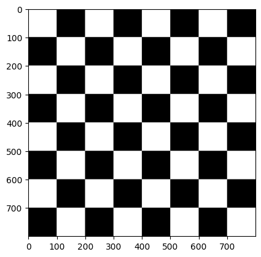
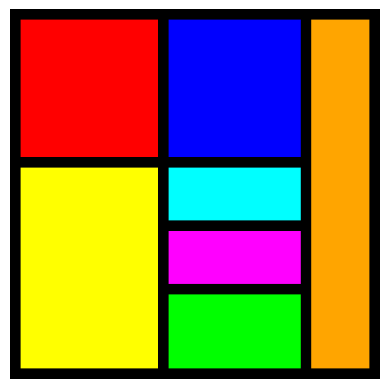

# Autoría
Este trabajo ha sido desarrollado en su totalidad por Daniel Fabelo Izquierdo.
Debido a la tardía incorporación a la asignatura, esta primera práctica fue realizada de forma individual por cada uno de los integrantes del grupo 27.
  
# Tarea 1: Crear una imagen con la textura de un tablero de ajedrez
Se crea una imagen de 800x800 píxeles con la textura de un tablero de ajedrez. Cada casilla del tablero es de 100x100 píxeles para replicar un tablero real.

Para la implementación, primero se crea una imagen vacía utilizando la función np.zeros() de la biblioteca numpy. Esta matriz representa una imagen en formato RGB.
Luego, se recorre la imagen usando dos bucles anidados for, donde las variables i y j corresponden a las coordenadas de las filas y columnas de la imagen. Los bucles avanzan de casilla en casilla (100 píxeles). Para alternar entre las casillas blancas y negras, se emplea una condición que se basa en los índices de las casillas.
Como la imagen de fondo ya es negra, se rellenan solo los cuadrados de color blanco.

Finalmente, la imagen generada se visualiza utilizando la función imshow() de la biblioteca matplotlib. 

# Tarea 2: Crear una imagen estilo Mondrian
Se crea una imagen de 350x350 píxeles que simule el estilo arístico de Mondrian.

Para empezar, se ha creado una imagen en negro utilizando la función np.zeros(), que genera una matriz tridimensional llena de ceros con las dimensiones especificadas anteriormente y tres planos de color. 
A partir de esta base en negro, se han coloreado diferentes áreas rectangulares de la imagen usando coordenadas específicas.
Se pueden encontrar en la parte superior rectángulos rojos y azul, y uno a la derecha de color naranja que ocupa casi todo el alto de la imagen.
Por otro lado, encontramos rectángulos amarillos, cian, magenta y verde en la parte inferior. 

Para mostrar la imagen, se ha utilizado la función imshow() de matplotlib, que permite visualizar la composición generada. Además, se ha ocultado la visualización de los ejes utilizando axis('off').

# Tarea 3: Resuelve una de las tareas previas (a elegir) con las funciones de dibujo de OpenCV
Para esta tarea, se ha elegido la creación de la imagen estilo Mondrian.

A diferencia de la implementación anterior, en la que se asignaban colores directamente a determinadas regiones de la matriz, aquí se utiliza la función cv2.rectangle() para dibujar los bloques de color.
Primero, se crea una imagen en negro utilizando np.zeros(), la cual genera una matriz de ceros de tamaño 350x350 píxeles, con tres planos de color. 
Posteriormente, se emplea cv2.rectangle() para dibujar rectángulos de colores en diferentes áreas de la imagen. La función cv2.rectangle() recibe como parámetros la imagen sobre la que se va a dibujar, las coordenadas de las esquinas superior izquierda e inferior derecha de cada rectángulo y con el parámetro -1 se rellenan completamente. 
El dibujo resultante es una copia del de la tarea anterior. 

Finalmente, se visualiza utilizando matplotlib con la función imshow(). Además, se ocultan los ejes con axis('off') y se guarda la imagen generada en el disco duro en fornmato JPEG mediante la función cv2.imwrite().

# Tarea 4: Modificar de forma libre los valores de un plano de la imagen
Se captura la imagen en tiempo real desde la webcam, y se aplican modificaciones creativas a los diferentes planos. Se utiliza la librería OpenCV para la captura de video y el procesamiento de imágenes, junto con numpy para las operaciones en los planos de color.

El fotograma se captura utilizando vid.read(), se separan los tres canales de color de la imagen en matrices independientes: el canal azul (B), el verde (G) y el rojo (R). Posteriormente, se aplican distintas transformaciones a cada canal de la siguiente manera:

· Canal Rojo (R): Se invierten los valores de los píxeles, de manera que cada valor de rojo se sustituye por su complementario con respecto a 255. Esto crea un efecto de inversión de color en este canal.

· Canal Verde (G): Se aumenta el brillo sumando 100 a cada valor de píxel del canal verde. Para asegurarnos de que los valores no excedan el rango válido (0-255), se utiliza la función np.clip().

· Canal Azul (B): Se aplica un desenfoque gaussiano con un kernel de tamaño (45, 55) sobre el canal azul. Este filtro suaviza los detalles de este canal, creando un efecto borroso.

Los tres planos modificados se concatenan horizontalmente usando np.hstack(), formando una imagen que muestra las tres variaciones del mismo fotograma en paralelo. Posteriormente, la imagen resultante se redimensiona a la mitad de su altura y se multiplica por 1.5 en el ancho para asegurar que quepa en la pantalla. La función cv2.imshow() se utiliza para visualizar este collage en una ventana.
El bucle de captura de video continúa ejecutándose hasta que el usuario presiona la tecla "ESC", lo que detiene el programa y libera la cámara mediante vid.release(), además de cerrar las ventanas abiertas con cv2.destroyAllWindows().

# Tarea 5: Pintar círculos en las posiciones del píxel más claro y oscuro de la imagen
En esta tarea, se carga una imagen en color, se convierte a escala de grises y se identifican los píxeles más claro y más oscuro de la imagen. Posteriormente, se dibujan círculos sobre la imagen original en las posiciones de estos píxeles.

La imagen es cargada utilizando la función cv2.imread(), que por defecto lee la imagen en formato BGR (azul, verde, rojo). Para realizar la detección del píxel más claro y más oscuro, la imagen se convierte a escala de grises mediante la función cv2.cvtColor().
La función cv2.minMaxLoc() es la encargada de encontrar el valor mínimo y máximo de la imagen en escala de grises, junto con sus respectivas coordenadas. Los valores mínimo y máximo representan el píxel más oscuro y más claro, respectivamente.

Una vez identificadas las coordenadas, se utilizan las funciones de dibujo de OpenCV. Para marcar el píxel más claro, se dibuja un círculo de color rojo sobre la imagen en la coordenada almacenada en coordenada_clara. De manera similar, para el píxel más oscuro, se dibuja un círculo verde en la posición coordenada_oscura.

Finalmente, para mostrar la imagen con los círculos, se utiliza matplotlib. Como OpenCV maneja las imágenes en formato BGR, es necesario convertir la imagen de BGR a RGB antes de visualizarla, lo cual se realiza con la función cv2.cvtColor().

# Tarea 6: Propuesta propia de pop art utilizando la cámara web
En esta tarea, se captura la imagen desde la webcam y se crea una composición visual que recuerda al estilo "Pop Art". Esta composición consta de una matriz de 2x2 imágenes, donde cada una de las cuatro partes aplica una transformación diferente sobre el mismo fotograma capturado.

Para capturar la imagen, se realiza el mismo procedimiento que en la Tarea 4. En este caso, para hacer la visualización más eficiente y fácil de gestionar, se reduce la resolución de la cámara a la mitad tanto en ancho como en alto.
Se define una imagen collage vacía que tiene el doble de ancho y alto que el fotograma de la cámara, lo que permite crear una cuadrícula de 2x2.

Se aplican las siguientes transformaciones de color:

· Esquina superior izquierda: Negativo. Los valores de cada canal de color se invierten restando su valor de 255.

· Esquina superior derecha: Brillo en el rojo. se aumenta el brillo en el canal rojo utilizando np.clip() para asegurar que los valores no excedan el rango de 0 a 255.

· Esquina inferior izquierda: Escala de grises. La imagen se convierte a escala de grises con cv2.cvtColor() y se copia el valor de gris en los tres canales (azul, verde y rojo), eliminando la saturación de la imagen.

· Esquina inferior derecha: Intercambio de canales. los valores del canal verde se asignan al canal azul y viceversa, generando un cambio interesante en la disposición de los colores.

El resultado de todas estas transformaciones se muestra en tiempo real en una ventana con la función cv2.imshow(). La ventana muestra las cuatro versiones modificadas del mismo fotograma simultáneamente, creando una composición característica del arte pop.
El bucle se ejecuta hasta que el usuario presiona la tecla "ESC", momento en el cual se detiene la captura de video y se cierran todas las ventanas abiertas con cv2.destroyAllWindows().

# Referencias y Fuentes Utilizadas
El código base utilizado en el desarrollo de las tareas fue proporcionado a través del Moodle de la asignatura Visión por Computador. Este código sirvió como punto de partida para implementar las soluciones propuestas en las distintas tareas.

Para la documentación sobre las funciones de dibujo de OpenCV, se hizo uso del enlace proporcionado por el profesor.

En cuanto a la imagen utilizada en la Tarea 5, fue obtenida mediante una búsqueda en Google.

Finalmente, para las tareas relacionadas con las modificaciones de los planos de color y la creación del efecto Pop Art en la Tarea 6, se buscó información y referencias a través de ChatGPT, donde se consultaron y adaptaron ideas y soluciones que ayudaron a implementar dichas funcionalidades.
