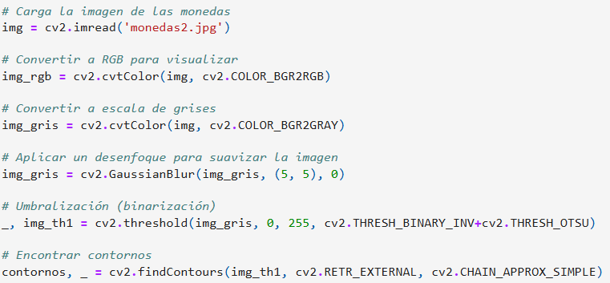

# Auditoría
El desarrollo de la práctica 2 ha sido realizado por Anixia Di Gregorio y Daniel Fabelo Izquierdo.

# Tarea 1: Detector de Monedas
La finalidad de esta tarea es detectar y clasificar monedas en imágenes, así como calcular el valor total del dinero existente en la foto. 
El usuario identifica de forma interactiva una moneda (haciendo clic en ella) de un valor determinado (en nuestro caso, una moneda de 2€) y posteriormente, calcula el número total de monedas y la cantidad total de dinero presente en la imagen.

Al iniciar el programa, primero se carga una imagen de monedas desde el disco. Esta imagen se lee en formato BGR y se transforma posteriormente a escala de grises debido a que se simplifica el procesamiento posterior.
Para mejorar la calidad de la imagen y reducir el ruido que podría interferir en la detección, se aplica un desenfoque gaussiano. Este método suaviza la imagen, permitiendo que los contornos de las monedas se definan con mayor claridad. 
Después de esto, se utiliza una técnica de umbralización, específicamente el método de Otsu. Gracias a esto, las áreas que representan las monedas se convierten en blancas, mientras que el fondo se convierte en negro, facilitando la identificación de los contornos de las monedas.

El siguiente paso es detectar los contornos de los objetos presentes. La función findContours es la encargada de esto, y devuelve una lista de los contornos encontrados en la imagen. Estos contornos se recorren para calcular el área de cada uno. Si un contorno tiene un área superior a un umbral específico (en este caso, 10 píxeles), se considera que representa una moneda. 
Se calcula el diámetro de cada moneda utilizando la función minEnclosingCircle, que determina el círculo más pequeño que puede encerrar el contorno detectado.
Para que el sistema pueda realizar el cálculo de forma precisa, el usuario debe seleccionar una moneda de 2€ de referencia haciendo clic sobre ella en la imagen. Esto permite establecer un factor de conversión entre los píxeles (medida utilizada en la imagen) y los milímetros (medida real). 

Con el factor de conversión establecido, el programa vuelve a recorrer los contornos detectados. En este proceso, convierte el diámetro de cada moneda de píxeles a milímetros utilizando el factor de conversión calculado anteriormente. Luego, compara el diámetro convertido con un conjunto de diámetros conocidos de diferentes monedas. 
Si el diámetro de una moneda detectada coincide dentro de un margen de tolerancia establecido (0.75 mm en este caso) con alguno de los diámetros conocidos, se identifica la moneda y se suma su valor al total.

Finalmente, el programa imprime en la consola el total de monedas detectadas y la cantidad total de dinero que representan. 

# Tarea 2: Clasificador de fragmentos, pellets y alquitrán

El propósito de esta tarea es realizar el análisis y la clasificación de imágenes que contienen fragmentos, pellets y alquitrán.

Inicialmente, se cargan las tres imágenes correspondientes a estos elementos y se convierten a espacios de color HSV para extraer las características de color y forma, y a escala de grises para la detección de contornos.

En la preprocesamiento, se aplica un filtro gaussiano para reducir el ruido y luego se realiza la binarización con el método de Otsu. Después de la binarización, la imagen se modifica para eliminar pequeños ruidos mediante las funciones dilate y erode. La primera expande las áreas blancas, mientras que la segunda las reduce, permitiendo separar objetos cercanos y rellenar los espacios dentro de los contornos.

A continuación, se detectan los contornos de los objetos y se dibujan en imágenes vacías.

En cuanto a la extracción de características, para cada contorno se calculan la circularidad, compacidad, el promedio de los valores HSV y la relación de aspecto (aspect ratio), y se calculan las estadísticas correspondientes utilizando funciones de NumPy (mínimo, máximo y promedio).

Los objetos luego se clasifican según las características extraídas, en particular la circularidad, el valor V de HSV y la relación de aspecto.

Finalmente, se crean etiquetas reales y predicciones, se calculan la exactitud, precisión, recall y lo score F1, y se visualiza la matriz de confusión para comparar las predicciones con los valores reales.