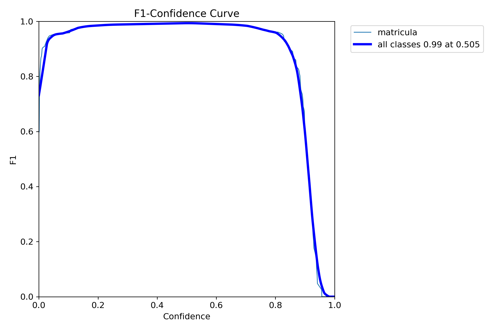
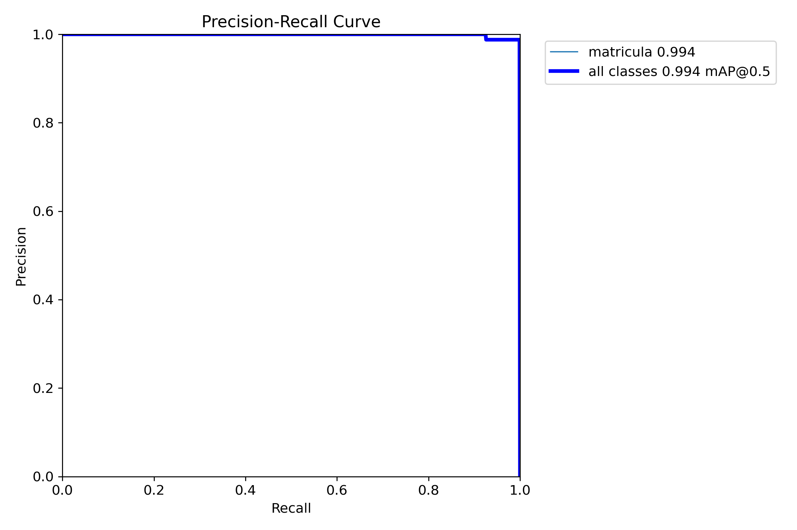
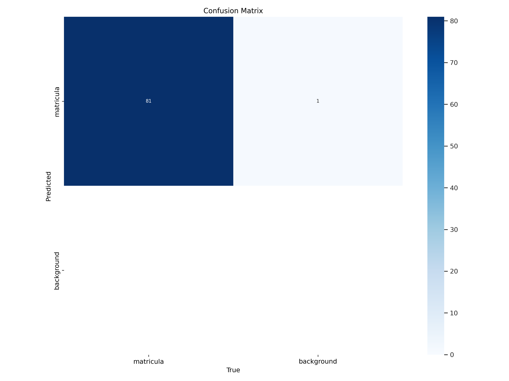

# Autoría
Este programa ha sido desarrollado por Anixia Di Gregorio y Daniel Fabelo 

# Detección de Matrículas, Personas y Coches en Video

Este proyecto implementa un sistema de detección en video para identificar matrículas, personas y coches en un flujo de video en tiempo real. Usamos dos modelos YOLO que trabajan en paralelo: uno está entrenado para detectar y extraer el texto de matrículas, y el otro para identificar personas y vehículos. Además de la detección, el sistema realiza un procesamiento de reconocimiento óptico de caracteres (OCR) en las matrículas para capturar y validar el texto, permitiendo su correcta extracción y almacenamiento.

# Entrenamiento
Inicialmente se entrenó el modelo yolo11n.pt con el conjunto de datos https://universe.roboflow.com/projectyolo-qvrgr/license-plate-detection-1v7hv, para el reconocimiento de matrículas. En particular, se entrenó durante 50 épocas, y a continuación es posible ver los resultados del entrenamiento:

<p align="center">
  
  
  
</p>

# Uso del código
Para ejecutar el código, necesitas un archivo de video de entrada y los modelos YOLO. Cambia el parámetro input_video_path a la ruta del video que deseas analizar y asegura que model1 y model2 apunten a los modelos YOLO entrenados. Aquí, model1 está configurado para detectar matrículas, y model2 para detectar personas y coches.
El programa captura el video y procesa cada fotograma, aplicando ambos modelos para identificar y etiquetar los objetos. También aplica OCR en las matrículas, las cuales se extraen y validan según un patrón de formato (por ejemplo, 1234 ABC)

```
# Cargar los modelos YOLO
model1 = YOLO("../models/best_vc.pt")  # Modelo para matrículas
model2 = YOLO("../models/yolo11n.pt")  # Modelo preentrenado para objetos (personas, coches, etc.)

# Configuración de captura de video
input_video_path = "C:/Users/danif/Downloads/C0142.MP4"
output_video_path = 'output_with_detections.mp4'
vid = cv2.VideoCapture(input_video_path)
```

# Detección de Matrículas, Personas y Coches
Cada fotograma del video se procesa con dos modelos YOLO. Primero, model1 identifica las matrículas y corta la imagen de cada matrícula detectada. Luego, se preprocesa la imagen mediante conversión a escala de grises, mejora de contraste y filtrado, mejorando así la precisión de OCR. El modelo model2 detecta personas y coches en el video, y el conteo de estas detecciones se muestra en pantalla en tiempo real.

Además de la detección por fotograma, el programa mantiene un conteo acumulativo de las personas y coches detectados a lo largo del video. Esta información se muestra en el video para que el usuario vea el total de objetos detectados de cada clase durante toda la ejecución.

# Almacenamiento de Resultados
El sistema genera dos salidas principales. La primera es un video anotado, output_with_detections.mp4, donde se resaltan las detecciones de personas, coches y matrículas, junto con el conteo acumulativo de objetos de cada clase. La segunda salida es un archivo CSV (detections.csv), en el cual cada fila representa una detección individual e incluye información detallada como el índice de fotograma, clase del objeto, nivel de confianza y coordenadas del rectángulo de detección. Si el objeto detectado es una matrícula, también se guarda el texto extraído de la imagen.

# Referencias y Fuentes Utilizadas
El código base utilizado en el desarrollo de las tareas fue proporcionado a través del Moodle de la asignatura Visión por Computador. Este código sirvió como punto de partida para implementar las soluciones propuestas en las distintas tareas.

En cuanto al vídeo, ha sido usado el proporcionado por el profesor.

Finalmente, para llevar acabo los requerimientos de la entrega, se buscó información y referencias a través de ChatGPT, donde se consultaron y adaptaron ideas y soluciones que ayudaron a implementar dichas funcionalidades.